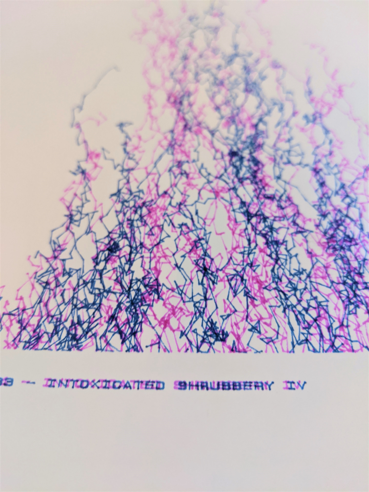

import TheDoubleImage from '../../components/ImageComponent/TheDoubleImage/TheDoubleImage.astro';
import plottingResult from '../../images/plotting/drunk_trees.jpg';
import initialSketch from '../../images/plotting/intoxicated_shrubbery_sketch.jpg';

<TheDoubleImage src1={initialSketch.src} src2={plottingResult.src}/>

I was lying in the park on a sunny afternoon trying to
think of ideas of what to plot on my recently acquired HP7475A. There wasn't much there besides some grass, a few trees and some
shrubs. Plotting a whole tree I thought is much too difficult. But the shrubs seemed doable - all of the thick shrubs
seemed to grow in a nice parabolic arc, with the tallest branches growing from the center, and the height decreasing
smoothly the further you went from the middle.

Here's the rough sketch I made in the park so I wouldn't forget (I think the drawings on the left are dandelion-inspired
ideas that are yet to be realized):


It's a random walk, starting from the bottom and moving in a random direction at each "step" - except the step size
is larger if the random choice is directed upwards. The total length ("mass") of each
branch is decided semi-randomly at the beginning, and is higher near the horizontal center of the page than the edges.

Here's a more detailed breakdown with some code: 

1. Choose a point on the bottom edge of the page to start a branch.
   
   ```Java
   int delta = int(random(-3000,2000));
   i=0;
   x= xMax;
   y = int(HORIZONTAL_CENTER + delta);
   ```

2. Depending on the distance of the point from the horizontal center, choose a random *mass* for the branch. The further
   from the middle, the smaller the *mass*.

   ```Java
    mass = int(random(8, 180 - abs(delta)/12)); // Quick solution with trial and error. You could do better by using a formula for a curve.
   ```

3. Choose a new point, a random distance away from the last point. The point has a bias towards negative x (up on the
   sheet), so the branches grow upwards.

    ```Java
      x = int(x + spacing*random(-2, 1));
      y = int(y + spacing*random(-1, 1));
    ```

4. Draw a line between the original point and the new point, and increase mass used by 1.

    ```Java
      i = i + 1;
    ```

5. Repeat steps 3 and 4 until either all the *mass* has been used up, or the branch goes out of bounds of the drawing
   area.

    ```Java
      if ( x > xMin && x < xMax && y > yMin && y < yMax && i < mass && iterations < MAX_ITERATIONS) {
          line_clipped(x0, y0, x, y, up);
          i = i + 1; // increase mass used
      }
    ```


   
   ```Java
   void draw() {
     int spacing = 100;
     int x0, y0;
     int MAX_ITERATIONS = 300;
   
     x0 = x;
     y0 = y;
   
     x = int(x + spacing*random(-2, 1));
     y = int(y + spacing*random(-1, 1));
   
     if ( x > xMin && x < xMax && y > yMin && y < yMax && i < mass && iterations < MAX_ITERATIONS) {
         line_clipped(x0, y0, x, y, up); // draws lines only if they're in the reduced drawing area
         i=i+1;
         up = false;
   
     } else {
       int delta = int(random(-3000,2000));
       i=0;
       x= xMax;
       y = int(HORIZONTAL_CENTER + delta);
       mass = int(random(8, 180 - abs(delta)/12)); // Hacky way of getting shorter branches when they start nearer to the edge
       iterations = iterations + 1;
       up = true; // lift the pen if a branch is finished
   
       int pen = round(random(1, 2));
       if (pen != currentPen) {
         plotter.write("SP"+ pen + ";", 3000); //Select pen
         plotter.write("PU"+x+","+y+";", 4000); //Position pen
         println("pen: " + pen);
       }
       currentPen = pen;
   
     }
   
     if (iterations == MAX_ITERATIONS) {
         plotter.write("PU"+0+","+0+";"); //Position pen at origin when done plotting
   
     }
   
   }
   ```
   
   And that's it!
   
   Complete Processing code with all of the surrounding stuff:
   
   ```Java
     import processing.serial.*;
   
     Serial myPort;    // Create object from Serial class
     Plotter plotter;  // Create a plotter object
     int val;          // Data received from the serial port
     int lf = 10;      // ASCII linefeed
   
     //Enable plotting?
     boolean PLOTTING_ENABLED = true;
     boolean draw_box = false;
     boolean draw_label = true;
     boolean up = true;
   
     boolean just_draw = false;
   
   
     //Label
     String dateTime = day() + "/" + month() + "/" + year() + " " + hour() + ":" + minute() + ":" + second() + " - ";
     String label = dateTime + "INTOXICATED SHRUBBERY IV";
   
     //Plotter dimensions
     int xMin = 600;
     int yMin = 800;
     int xMax = 10300 - 300;
     int yMax = 8400 - 600;
     int A4_MAX_WIDTH = 10887;
     int A4_MAX_HEIGHT = 8467;
     int VERTICAL_CENTER = (xMax + xMin) /2;
     int HORIZONTAL_CENTER = (yMax + yMin) /2;
   
   
     int i = 0;
     int iterations = 0;
     int lastY = yMin;
     int currentPen = 1;
   
     int x = -9999999;
     int y = -9999999;
     int mass = 50;
   
     //Let's set this up
     void setup() {
       print(dateTime);
       background(233, 233, 220);
       size(840, 1080);
       smooth();
   
       if (just_draw) {
         draw_box = false;
         draw_label = false;
         PLOTTING_ENABLED = true;
       }
   
       //Select a serial port
       println(Serial.list()); //Print all serial ports to the console
       String portName = Serial.list()[1]; //make sure you pick the right one
       println("Plotting to port: " + portName);
   
       //Open the port
       myPort = new Serial(this, portName, 9600);
       myPort.bufferUntil(lf);
   
       //Associate with a plotter object
       plotter = new Plotter(myPort);
   
       //Initialize plotter
       plotter.write("IN;SP2;");
       //Draw a label first (this is pretty cool to watch)
   
       if (draw_label) {
       int labelX = xMax + 300;
       int labelY = yMin;
   
       if (PLOTTING_ENABLED) {
         plotter.write("PU"+labelX+","+labelY+";"); //Position pen
         plotter.write("SI0.14,0.14;DI0,1;LB" + label + char(3)); //Draw label
         println("drawing label");
         delay(label.length() * 500);
         println("label done");
       }
   
       fill(50);
       float textX = map(labelX, 0, A4_MAX_HEIGHT, 0, width);
       float textY = map(labelY, 0, A4_MAX_WIDTH, 0, height);
   
       text(dateTime + label, textY, textX);
       }
   
       if (draw_box) {
   
         //box
         drawLine(xMin, yMin, xMax, yMin, true);
         drawLine(xMax, yMin, xMax, yMax, true);
         drawLine(xMax, yMax, xMin, yMax, true);
         drawLine(xMin, yMax, xMin, yMin, true);
   
         // diagonals
         drawLine(xMin, yMin, xMax, yMax, true);
         drawLine(xMin, yMax, xMax, yMin, true);
   
         //vertical line down from middle
         line_clipped(xMin, (yMax + yMin) /2, xMax, (yMax + yMin) /2, true);
   
         //horizontal line
         line_clipped((xMax + xMin) /2, yMin, (xMax + xMin) /2, yMax, true);
       }
   
     }
   
     void draw() {
       int spacing = 100;
       int x0, y0;
       int MAX_ITERATIONS = 150;
   
       //horizontal line
       x0 = x;
       y0 = y;
   
       x = int(x + spacing*random(-2, 1));
       y = int(y + spacing*random(-1, 1));
   
       if ( x > xMin && x < xMax && y > yMin && y < yMax && i < mass && iterations < MAX_ITERATIONS) {
           line_clipped(x0, y0, x, y, up);
           i=i+1;
           up = false;
   
       } else {
   
         int delta = int(random(-3000,2000));
         println("delta=" + delta);
         x = int(VERTICAL_CENTER + random(-5, 5));
         y = int(HORIZONTAL_CENTER + delta);
         x= xMax;
         i=0;
         mass = int(random(8, 180 - abs(delta)/12));
         println(iterations);
         iterations = iterations + 1;
         up = true;
   
         int pen = round(random(1, 2));
         currentPen = pen;
         if (pen != currentPen) {
           plotter.write("SP"+ pen + ";", 3000); //Select pen
           plotter.write("PU"+x+","+y+";", 4000); //Position pen
           println("pen: " + pen);
         }
   
   
       }
   
       if (iterations == MAX_ITERATIONS) {
           plotter.write("PU"+0+","+0+";"); //Position pen
       }
   
     }
     /*
     * Encode a given point (x, y) into the different regions of
     * a clip window as specified by its top-left corner (cx, cy)
     * and it's width and height (cw, ch).
     */
     int encode_endpoint(
       float x, float y,
       float clipx, float clipy, float clipw, float cliph)
     {
       int code = 0; /* Initialized to being inside clip window */
   
       /* Calculate the min and max coordinates of clip window */
       float xmin = clipx;
       float xmax = clipx + cliph;
       float ymin = clipy;
       float ymax = clipy + clipw;
   
       if (x < xmin)       /* to left of clip window */
         code |= (1 << 0);
       else if (x > xmax)  /* to right of clip window */
         code |= (1 << 1);
   
       if (y < ymin)       /* below clip window */
         code |= (1 << 2);
       else if (y > ymax)  /* above clip window */
         code |= (1 << 3);
   
       return code;
     }
   
     boolean line_clipped(
       float x0, float y0, float x1, float y1, boolean up) {
   
       float clipx = xMin;
       float clipy = yMin;
       float clipw = yMax-yMin;
       float cliph = xMax-xMin;
   
   
   
       /* Stores encodings for the two endpoints of our line */
       int e0code, e1code;
   
       /* Whether the line should be drawn or not */
       boolean accept = false;
       int tries = 0;
   
       do {
         /* Get encodings for the two endpoints of our line */
         e0code = encode_endpoint(x0, y0, clipx, clipy, clipw, cliph);
         e1code = encode_endpoint(x1, y1, clipx, clipy, clipw, cliph);
         tries = tries + 1;
         if (tries > 3) {
           println("tried too many times;");
           break;
         }
   
         if (e0code == 0 && e1code == 0) {
           /* If line inside window, accept and break out of loop */
           accept = true;
           break;
         } else if ((e0code & e1code) != 0) {
           /*
           * If the bitwise AND is not 0, it means both points share
           * an outside zone. Leave accept as 'false' and exit loop.
           */
           break;
         } else {
           /* Pick an endpoint that is outside the clip window */
           int code = e0code != 0 ? e0code : e1code;
   
           float newx = 0, newy = 0;
   
           /*
           * Now figure out the new endpoint that needs to replace
           * the current one. Each of the four cases are handled
           * separately.
           */
           if ((code & (1 << 0)) != 0) {
             /* Endpoint is to the left of clip window */
             //println("/* Endpoint is above the clip window */");
   
             newx = xMin;
             newy = ((y1 - y0) / (x1 - x0)) * (newx - x0) + y0;
           } else if ((code & (1 << 1)) != 0) {
             /* Endpoint is to the right of clip window */
             //println("/* Endpoint is below the clip window */");
   
             newx = xMax;
             newy = ((y1 - y0) / (x1 - x0)) * (newx - x0) + y0;
           } else if ((code & (1 << 3)) != 0) {
             /* Endpoint is above the clip window */
             //println("/* Endpoint is to the right of the clip window */");
             newy = yMax;
             newx = ((x1 - x0) / (y1 - y0)) * (newy - y0) + x0;
           } else if ((code & (1 << 2)) != 0) {
             /* Endpoint is below the clip window */
             //println(" /* Endpoint is to the left of the clip window */");
             newy = yMin;
             newx = ((x1 - x0) / (y1 - y0)) * (newy - y0) + x0;
           }
   
           /* Now we replace the old endpoint depending on which we chose */
           if (code == e0code) {
             x0 = newx;
             y0 = newy;
           } else {
             x1 = newx;
             y1 = newy;
           }
           tries = tries +1;
         }
       } while (true);
   
   
       if (accept) {
         drawLine(x0, y0, x1, y1, up);
       }
   
       return accept;
     }
   
     void drawLine(float x1, float y1, float x2, float y2, boolean up) {
       float _x1 = map(x1, 0, A4_MAX_HEIGHT, 0, width);
       float _y1 = map(y1, 0, A4_MAX_WIDTH, 0, height);
   
       float _x2 = map(x2, 0, A4_MAX_HEIGHT, 0, width);
       float _y2 = map(y2, 0, A4_MAX_WIDTH, 0, height);
       line(_y1, _x1, _y2, _x2);
   
       String pen = "PD";
       if (up) {
         pen="PU";
       }
   
   
       plotter.write(pen+x1+","+y1+";");
       plotter.write("PD"+x2+","+y2+";"); //75 ms delay
   
       if (PLOTTING_ENABLED) {
         delay(200);
       }
     }
   
     void drawPoint(int x, int y) {
       float _x = map(x, 0, A4_MAX_HEIGHT, 0, width);
       float _y = map(y, 0, A4_MAX_WIDTH, 0, height);
   
       plotter.write("PU"+x+","+y+";"); //Position pen
       plotter.write("PD"+x+","+y+";"); //Position pen
   
       point(_y, _x);
       if (PLOTTING_ENABLED) {
         delay(250);
       }
     }
   
   
   
     /*************************
     Simple plotter class
     *************************/
   
     class Plotter {
       Serial port;
   
       Plotter(Serial _port) {
         port = _port;
       }
   
       void write(String hpgl) {
         if (PLOTTING_ENABLED) {
           port.write(hpgl);
         }
       }
   
       void write(String hpgl, int del) {
         if (PLOTTING_ENABLED) {
           port.write(hpgl);
           delay(del);
         }
       }
     }
   ```
